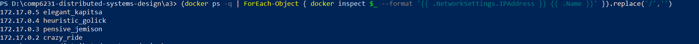

## MPI commands explanation

1. Pull base image
```
docker pull husseinabdallah2/mpi4py-cluster:master
```

2. Create 4 containers by running commands 4 times
```
docker run -dit husseinabdallah2/mpi4py-cluster:master
docker run -dit husseinabdallah2/mpi4py-cluster:master
docker run -dit husseinabdallah2/mpi4py-cluster:master
docker run -dit husseinabdallah2/mpi4py-cluster:master
```

3. List all containers and ip




4. Use container `crazy_ride` as master node, ssh to container
```
docker exec -it crazy_ride /bin/bash
``` 

5. Start ssh service
```
service ssh start
```

6. Create machinefile at path ~/ with the IP addresses of all nodes
```
172.17.0.3
172.17.0.4
172.17.0.4
```

7. Generate ssh key
```
ssh-keygen -t rsa​
```

8. Copy ssh key to each worker node
```
sh-copy-id -i ~/.ssh/id_rsa.pub root@172.17.0.3
sh-copy-id -i ~/.ssh/id_rsa.pub root@172.17.0.4
sh-copy-id -i ~/.ssh/id_rsa.pub root@172.17.0.5
```

9. From host ssh to worker container to start their ssh service
```
docker exec -it <worker_container_id> /bin/bash
service ssh start​
```

10. In each worker container, add master container ip to /etc/hosts
```
nano /etc/hosts

# add following
172.17.0.2  250ae9b27c01
```

11. From host copy all mpi python script and csv data file to each container
```
docker cp . crazy_ride:/root/
docker cp . pensive_jemison:/root/
docker cp . heuristic_golick:/root/
docker cp . elegant_kapitsa:/root/
```

12. Inside master node, run any mpi scripts from Q1 to Q4
```
root@250ae9b27c01:~# mpiexec -n 3 -machinefile ~/machinefile python ~/Q1_T3.py​
Worker 1 is assigned chunk 192512096 ../datasets/Combined_Flights_2021.csv
Worker slave 1 is done. Sending back to master
Worker 2 is assigned chunk 192512035 ../datasets/Combined_Flights_2021.csv
Worker slave 2 is done. Sending back to master
received from Worker slave 1
received from Worker slave 2
{('Southwest Airlines Co.',): 2326, ('American Airlines Inc.',): 759, ('Republic Airlines',): 704, ('United Air Lines Inc.',): 633, ('JetBlue Airways',): 487, ('GoJet Airlines, LLC d/b/a United Express',): 428, ('Spirit Air Lines',): 316, ('SkyWest Airlines Inc.',): 297, ('Delta Air Lines Inc.',): 295, ('Air Wisconsin Airlines Corp',): 286, ('Commutair Aka Champlain Enterprises, Inc.',): 202, ('Comair Inc.',): 202, ('Mesa Airlines Inc.',): 160, ('Envoy Air',): 135, ('Capital Cargo International',): 132, ('Alaska Airlines Inc.',): 127, ('Endeavor Air Inc.',): 80, ('Frontier Airlines Inc.',): 79, ('Allegiant Air',): 50, ('Horizon Air',): 42, ('Hawaiian Airlines Inc.',): 36}
Airline had the most canceled flights in September 2021 ('Southwest Airlines Co.',)
```
